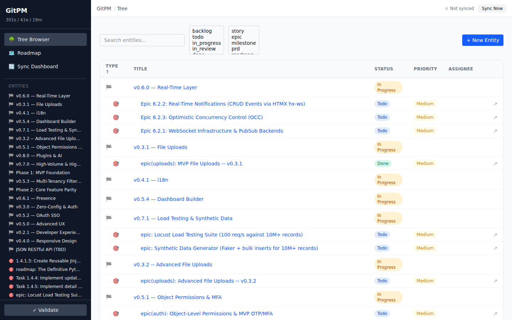
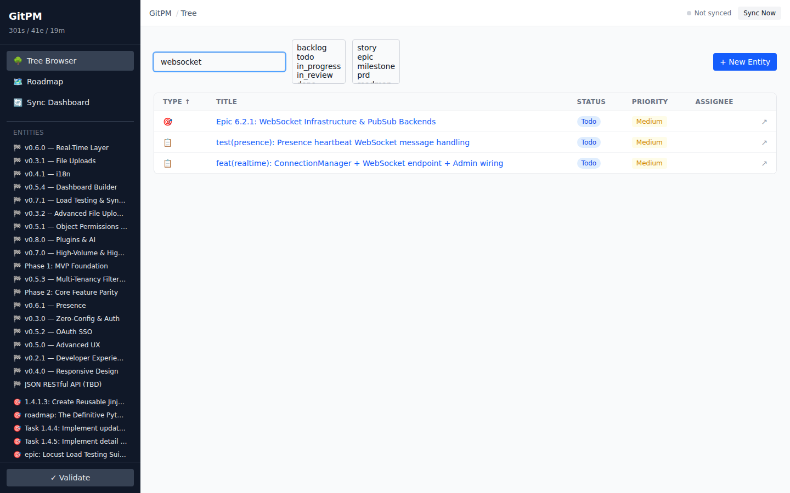
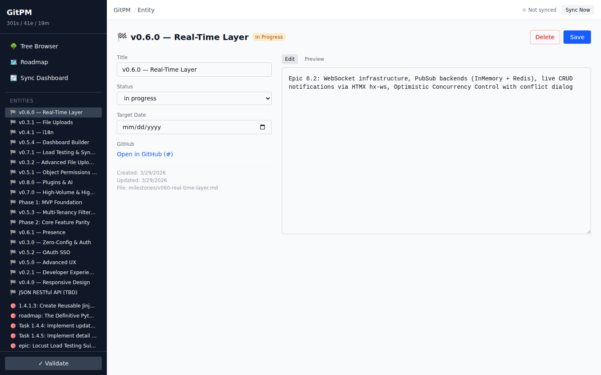
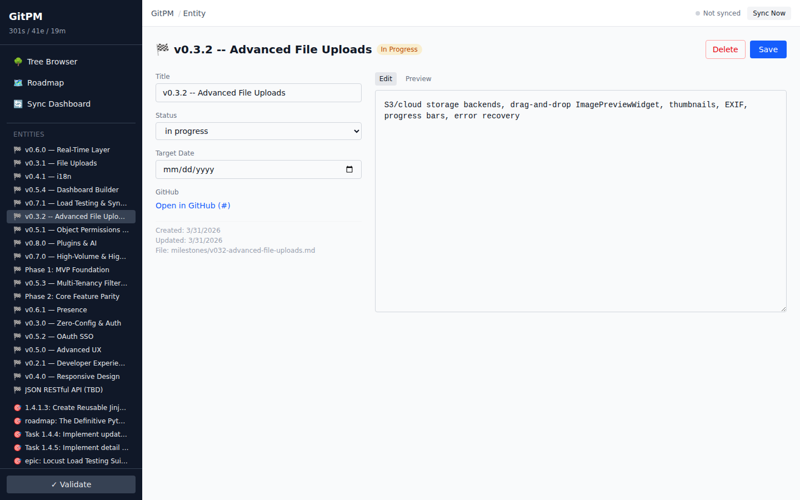
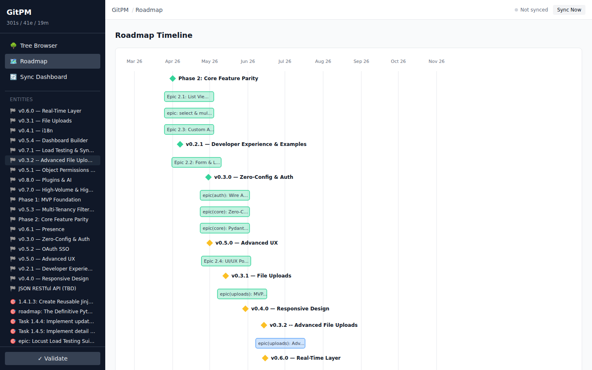
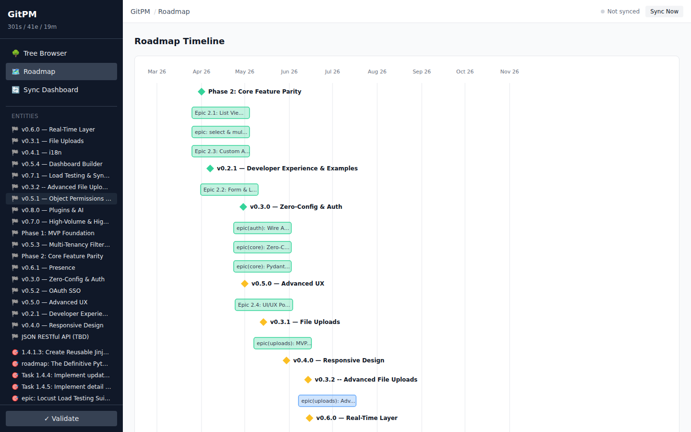
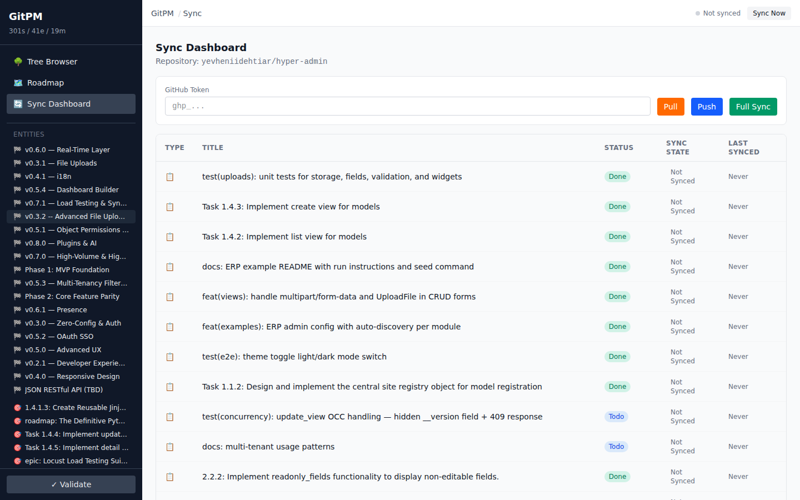

# GitPM — Product Demo

GitPM turns your repository into a project management system. Roadmaps, epics, stories, and milestones live as Markdown files in `.meta/` — version-controlled, AI-readable, and kept in bidirectional sync with GitHub, GitLab, or Jira. No SaaS lock-in. No context switching. Everything in one `git diff`.

---

## Use Case 1: Bootstrap a Project in Seconds

Scaffold a complete `.meta/` tree with a single command. You get a roadmap, a milestone, an epic, and a story — ready to customize.

```bash
gitpm init my-saas-app
```

```
Created .meta/ tree:
  .meta/roadmap/roadmap.yaml
  .meta/roadmap/milestones/mvp-launch.md
  .meta/epics/onboarding-flow/epic.md
  .meta/epics/onboarding-flow/stories/setup-auth.md
  .meta/stories/setup-ci.md

Run 'gitpm validate' to check the tree.
```

From here, expand the tree by adding more Markdown files — or let an AI agent do it for you (see Use Case 3).

---

## Use Case 2: Import an Existing GitHub Project

Already have hundreds of GitHub Issues? Pull them into `.meta/` in one command. Issues become stories, milestones map to milestones, and labels carry over.

```bash
export GITHUB_TOKEN="ghp_..."
gitpm import --repo acme/backend --strategy full
```

```
Fetching issues from acme/backend...
  Found 142 issues, 4 milestones
  Creating .meta/roadmap/milestones/q2-launch.md
  Creating .meta/roadmap/milestones/q3-scale.md
  Creating .meta/epics/auth-overhaul/epic.md
  Creating .meta/epics/auth-overhaul/stories/migrate-to-oauth2.md
  ... (138 more)
Import complete. 142 entities written to .meta/
```

Your entire project is now browsable as files, diffable in PRs, and readable by AI agents.

---

## Use Case 3: AI Agent Workflow

This is where GitPM shines. AI coding agents like Claude Code, Cursor, or Copilot can read the entire project context from `.meta/` — no API calls, no tool integration, no special setup. The file tree *is* the interface.

**An AI agent reading context:**

```
> "Read .meta/ to understand what needs to be built."

Agent reads:
  .meta/roadmap/roadmap.yaml          → project vision & milestones
  .meta/epics/payments/epic.md        → current epic scope
  .meta/epics/payments/stories/*.md   → individual tasks with acceptance criteria
```

**An AI agent creating a story:**

The agent writes a new file to `.meta/epics/payments/stories/add-stripe-webhooks.md`:

```markdown
---
type: story
id: STORY-047
title: Add Stripe webhook handler for payment confirmations
status: open
priority: high
labels: [backend, payments]
assignee: "@alice"
epic_ref: EPIC-012
---

## Description

Implement a webhook endpoint at `/api/webhooks/stripe` that handles
`payment_intent.succeeded` and `payment_intent.failed` events.

## Acceptance Criteria

- [ ] Endpoint validates Stripe signature
- [ ] Successful payments update order status to "confirmed"
- [ ] Failed payments trigger retry notification to the customer
- [ ] All events are logged to the audit table
```

Then sync to GitHub:

```bash
gitpm push
```

The story appears as a GitHub Issue — with labels, assignee, and milestone already set.

---

## Use Case 4: Bidirectional Sync

Your workflow doesn't have to be one-directional. Edit locally and push, or let teammates update issues on GitHub and pull their changes back.

**Push local changes to GitHub:**

```bash
# Edit a story locally
vim .meta/epics/payments/stories/add-stripe-webhooks.md
# Change status: open → in_progress, add implementation notes

gitpm push
```

```
Pushing changes to acme/backend...
  Updated: STORY-047 (status: open → in_progress)
Push complete. 1 entity synced.
```

**Pull remote changes:**

```bash
gitpm pull
```

```
Pulling from acme/backend...
  Updated: STORY-031 (assignee changed by @bob on GitHub)
  New:     STORY-048 (created by @carol on GitHub)
Pull complete. 2 entities updated.
```

**Full bidirectional sync:**

```bash
gitpm sync
```

Both sides reconciled in one pass. Local edits push up, remote changes pull down.

---

## Use Case 5: Conflict Resolution

When the same field is changed both locally and remotely, GitPM detects the conflict and lets you choose how to resolve it.

```bash
gitpm sync --strategy ask
```

```
Conflict on STORY-031:
  Field: priority
  Local:  high (changed 2h ago)
  Remote: critical (changed 1h ago by @bob)

  [L] Keep local  [R] Keep remote  [S] Skip
  > R

Sync complete. 1 conflict resolved (remote wins).
```

You can also set a default strategy to avoid prompts:

```bash
gitpm sync --strategy local-wins   # always prefer local changes
gitpm sync --strategy remote-wins  # always prefer remote changes
```

---

## Use Case 6: Local Web UI

GitPM includes a local web interface for visual project management. No cloud service — it reads and writes your `.meta/` files directly.

```bash
bun run dev:ui
# → http://localhost:5173
```

### Tree Browser

Browse all entities with filtering by status, type, priority, and assignee. Search across titles and descriptions.





### Entity Detail Views

View and edit epics and stories with structured form fields and a Markdown body editor.





### Roadmap Timeline

Visualize milestones and epics on an interactive SVG timeline with status indicators.





### Sync Dashboard

Monitor sync status and trigger push/pull/sync operations from the UI.



---

## Use Case 7: Code + Context in One PR

When a developer opens a pull request, the `.meta/` changes travel with the code. Reviewers see *what* changed and *why* in the same diff.

```diff
# Pull request: "feat: add Stripe webhook handler"

+ packages/api/src/webhooks/stripe.ts        # the code
+ packages/api/src/webhooks/stripe.test.ts   # the tests
~ .meta/epics/payments/stories/add-stripe-webhooks.md
    status: open → in_progress
    assignee: null → "@alice"
```

The story update is part of the commit. No separate step to update the tracker. No stale tickets.

---

## Getting Started

```bash
# Install
bun install -g gitpm

# Scaffold a new project
gitpm init my-project

# Or import from GitHub
gitpm import --repo owner/repo

# Validate
gitpm validate

# Start the web UI
bun run dev:ui
```

See the full [CLI Reference](cli-reference.md) and [Sync Configuration Guide](sync-guide.md) for detailed usage.
